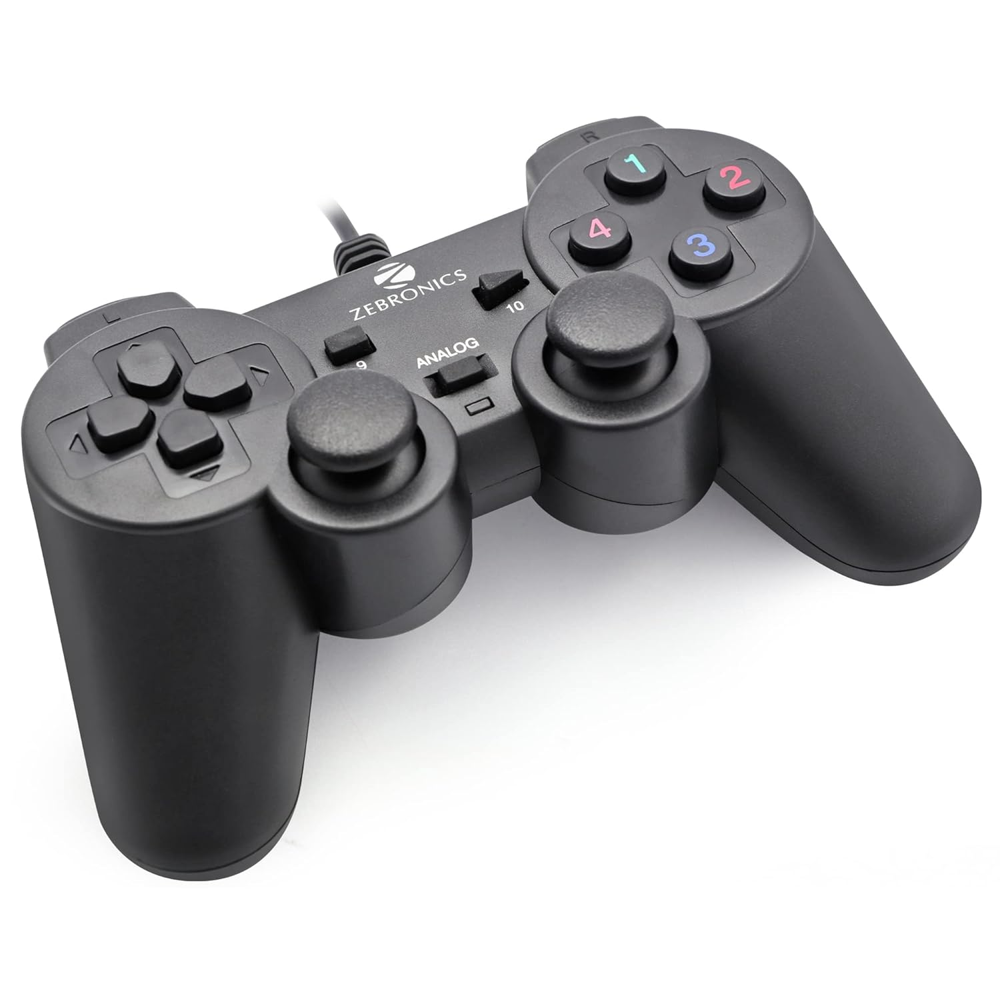
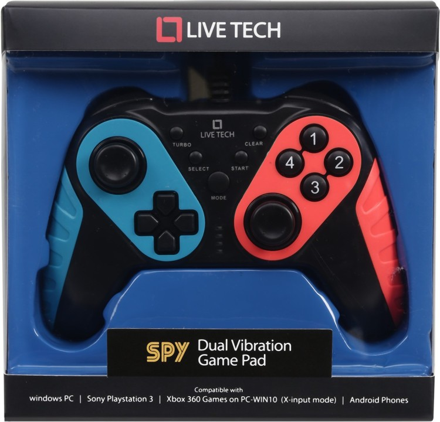

# MPG_Joypad
MPG_Joypad is a handheld device used in LINUXCNC systems to control axis movement manually.

# Debian Test Lab

| Name | Image | PCB_Image | device IDs | Port | Price | Testing Environment |  Info  |
| --- |  --- | :---: | :---: | --- |  --- | :---: | :---: |
| [ZEBRONICS ZEB-V260JP Gamepad]() | 

| | 0079:0006 |  USB 2.0 |   |  |  DragonRise Inc. PC TWIN SHOCK Gamepad |
| [Live Tech Spy USB Gamepad](https://www.flipkart.com/live-tech-spy-usb-gamepad/p/itmaa493ad9f36e8) | 

| | 2563:0526 |  USB 2.0 |   |  | ShenZhen ShanWan Technology Co., Ltd. Android Gamepad|
| [EvoFox Elite Ops Wireless Gamepad](https://www.amazon.in/Wireless-Gamepad-Android-Charging-Vibration/dp/B09F9CL2Y2) | 

| | 2563:0526 |  USB 2.0 (Wireless)|   |  |  ShenZhen ShanWan Technology Co., Ltd. Android Gamepad|

